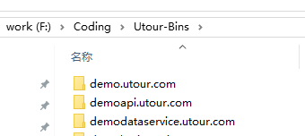

# 示例项目结构

###源代码存放目录结构

1. demo.utour.com
   >站点目录
2. demologicservice.utour.com
   >逻辑层服务项目目录
3. demodataservice.utour.com
   >数据层服务项目目录
4. damoapi.utour.com
   >WebApi项目
5. Utour-Bins
  >所有项目的DLL输出目录 	
6. Utour-Bins/xxx.xxx.com/Debug
   >对应各自项目的Debug版DLL输出目录
7. tour-Bins/xxx.xx.com/Release
   >对应各自项目的Release版DLL输出目录

###项目存放目录结构

* /demodataservice.utour.com
  >项目父目录
* /demodataservice.utour.com/Utour.DemoDataService.Business
  >业务逻辑实现，在此实现所有业务逻辑操作
* /demodataservice.utour.com/Utour.DemoDataService.DAInterface
   >数据接口层，在此定义各种业务单元数据操作接口
* /demodataservice.utour.com/Utour.DemoDataService.DataAccess
  >数据操作实现层，提供对数据接口层的某种数据库类型的实现
* /demodataservice.utour.com/Utour.DemoDataService.CAInterface
   >缓存接口层，在此定义各种业务单元缓存操作接口
* /demodataservice.utour.com/Utour.DemoDataService.CacheAccess
  >缓存操作实现层，提供对缓存接口层的某种缓存数据库类型的实现
* /demodataservice.utour.com/Utour.DemoDataService.Config
  >自定义配置，在此项目创建不同业务配置类
* /demodataservice.utour.com/Utour.DemoDataService.Entity
  >业务对象或数据实体层
* /demodataservice.utour.com/Utour.DemoDataService.ServiceHost
  >服务宿主项目，提供IIS宿主环境，调试服务的入口项目
* /demodataservice.utour.com/Utour.DemoDataService.ServiceInterface
  >wcf服务接口层（契约），在此暴露业务逻辑层的服务
* /demodataservice.utour.com/Utour.DemoDataService.ServiceHost/MonitorFiles: 
  >监控文件存放目录
* /demodataservice.utour.com/Utour.DemoDataService.ServiceHost/MonitorFiles/Config: 
  >Config文件存放目录
* /demodataservice.utour.com/Utour.DemoDataService.ServiceHost/MonitorFiles/SqlMap: 
  >SqlMap文件存放目录

###解决方案目录结构

