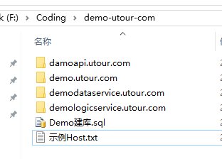
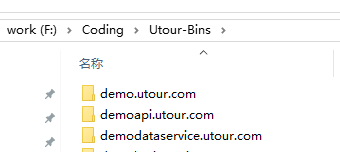
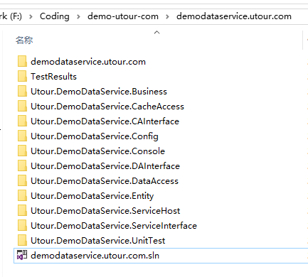
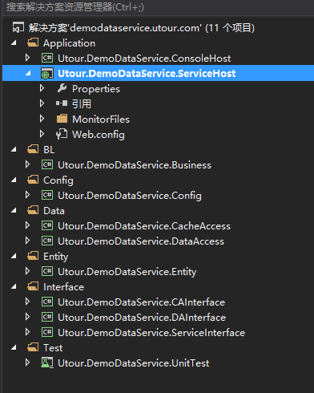

# 示例项目结构

###源代码存放目录结构

1. demo.utour.com
   >站点目录
2. demologicservice.utour.com
   >逻辑层服务项目目录
3. demodataservice.utour.com
   >数据层服务项目目录
4. damoapi.utour.com
   >WebApi项目
5. Utour-Bins
  >所有项目的DLL输出目录 	
6. Utour-Bins/xxx.xxx.com/Debug
   >对应各自项目的Debug版DLL输出目录
7. tour-Bins/xxx.xx.com/Release
   >对应各自项目的Release版DLL输出目录

###项目存放目录结构

* /demodataservice.utour.com
  >项目父目录
* /demodataservice.utour.com/Utour.DemoDataService.Business
  >业务逻辑实现，在此实现所有业务逻辑操作
* /demodataservice.utour.com/Utour.DemoDataService.DAInterface
   >数据接口层，在此定义各种业务单元数据操作接口
* /demodataservice.utour.com/Utour.DemoDataService.DataAccess
  >数据操作实现层，提供对数据接口层的某种数据库类型的实现
* /demodataservice.utour.com/Utour.DemoDataService.CAInterface
   >缓存接口层，在此定义各种业务单元缓存操作接口
* /demodataservice.utour.com/Utour.DemoDataService.CacheAccess
  >缓存操作实现层，提供对缓存接口层的某种缓存数据库类型的实现
* /demodataservice.utour.com/Utour.DemoDataService.Config
  >自定义配置，在此项目创建不同业务配置类
* /demodataservice.utour.com/Utour.DemoDataService.Entity
  >业务对象或数据实体层
* /demodataservice.utour.com/Utour.DemoDataService.ServiceHost
  >服务宿主项目，提供IIS宿主环境，调试服务的入口项目
* /demodataservice.utour.com/Utour.DemoDataService.ServiceInterface
  >wcf服务接口层（契约），在此暴露业务逻辑层的服务
* /demodataservice.utour.com/Utour.DemoDataService.ServiceHost/MonitorFiles: 
  >监控文件存放目录
* /demodataservice.utour.com/Utour.DemoDataService.ServiceHost/MonitorFiles/Config: 
  >Config文件存放目录
* /demodataservice.utour.com/Utour.DemoDataService.ServiceHost/MonitorFiles/SqlMap: 
  >SqlMap文件存放目录

###解决方案目录结构

> /Application
   * Utour.DemoDataService.ConsoleHost
   * Utour.DemoDataService.ServiceHost
      * /MonitorFiles
          * /Config--存放\*.Config文件
          * /SqlMap--存放\*.sqlmap或实体映射文件

> /BL
   * Utour.DemoDataService.Bussiness

> /Config
   * Utour.DemoDataService.Config

> /Data
   * Utour.DemoDataService.CacheAccess
   * Utour.DemoDataService.DataAccess

>/Entity
   * Utour.DemoDataService. Entity

>/Interface
   * Utour.DemoDataService.ServiceInterface
   * Utour.DemoDataService.CAInterface
   * Utour.DemoDataService.DAInterface

其中

/Application: 服务解决方案文件夹, 存放服务宿主项目
   >Utour.DemoDataService.ConsoleHost: 服务控制台宿主项目 
   >Utour.DemoDataService.ServiceHost: 服务iis宿主项目, 提供服务调试入口，部署发布.

/BL: 解决方案文件夹, 存放业务逻辑和业务层的实体和接口
  >Utour.DemoDataService.Bussiness: 业务逻辑项目, 包含服务契约接口的实现和其它内部业务逻辑
  >Utour.DemoDataService.CAInterface: 缓存数据存取接口 
  >Utour.DemoDataService.DAInterface: 数据库数据存取接口

/Config:配置实体解决方案目录
  >Utour.DemoDataService.Config: \*.Config文件映射的实体
/Data: 解决方案文件夹, 存放数据存取层的项目
  >Utour.DemoDataService.CacheAccess: 缓存数据存取, 实现CAInterface中的接口
  >Utour.DemoDataService.DataAccess: 数据库数据存取, 实现DAInterface中的接口

/Entity:解决方案文件夹
  >Utour.DemoDataService.Entity:服务传输实体对象定义，数据库映射实体定义

/Interface: 解决方案文件夹, 存放项目定义的接口，服务接口，缓存接口，数据接口等
  >Utour.DemoDataService.ServiceInterface: 服务的契约接口
  >Utour.DemoDataService.CAInterface: 缓存接口 
  >Utour.DemoDataService.DAInterface: 数据接口