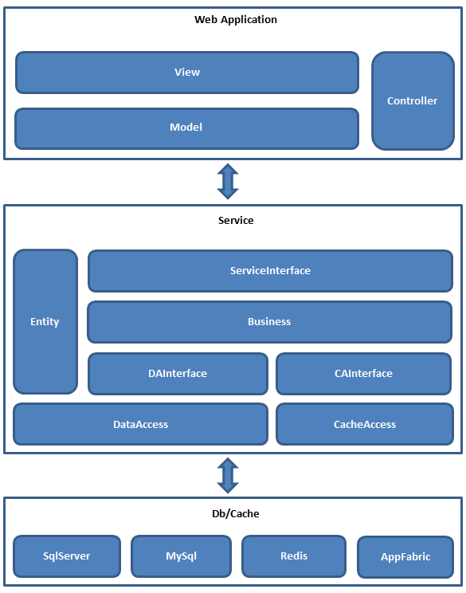

# 1.2 框架整体图

基于框架各个模块的作用和功能，再结合实际业务开发的项目，我们就可以按照如下的层次结构搭建一套基于框架的一个整体项目架构.

###项目架构层次图

 ####层次结构说明
 
 1. 架构整体依然采用经典单独三层模式
 2. 层于层之间都是通过接口向下进行引用，完全面向接口编程
 3. 数据层和缓存层向上提供数据接口(DAInterface)和缓存接口(CAInterface)，业务逻辑层和数据层或缓存层只通过接口引用调用，获取对应接口的实例则是通过框架动态注入创建
 4. 业务逻辑层提供业务服务，对Web应用通过
