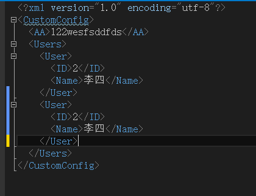

# 配置的监控及读取

框架配置，提供了基于框架开发所需的各种类型的配置，使用框架内置配置后，在项目的web.config或app.config仅仅配置最基本的节点（见下方）, 其他的配置(框架配置和自定义配置)按类别集中归置到特定区域, 利用框架的配置监控机制, 实现配置的动态读取和更新。

####配置如何被监控

* 配置监控需要在每个启动项目的配置文件web.config或app.config中设置配置文件的监控目录
  ```xml
  <appSettings>
    <!--配置监控目录，目录可自定义，但必须是从项目根目录开始的相对地址-->
    <add key="MonitorFilesPath" value="MonitorFiles" />
  </appSettings>
  ```
* 必须把配置文件要统一放到 “[监控目录]/Config”下，sqlmap配置放到“[监控目录]/SqlMap”下

####配置如何读取

1. 首先配置文件需要有对应的配置类映射，且配置类必须继承自```Utour.Framework.Config.ConfigUnit```


2. 使用```ConfigFactory.GetConfig<T>()```工厂读取


###注意事项

####安全事项
 MonitorFiles监控目录下配置涉及数据库缓存连接串等重要信息，为了保障监控目录文件安全，在部署服务或网站项目时，对于外网必须**禁用IIS目录浏览**，并在Web.config中针对**监控目录设置访问权限**，禁止浏览器直接访问，有以下两种方式进行权限设置
 
 1. 直接在项目根Web.config加入以下配置
   ```xml
    <!--禁止访问监控目录,MonitorFiles为监控目录名称-->
    <location path="MonitorFiles">
        <system.web>
          <authorization>
            <deny users="?"/>
          </authorization>
        </system.web>
    </location>
   ```
   
 2. 直接在监控目录下新建一个子Web.config，配置为如下内容：
     ```xml
       <configuration>  
        <system.web>
          <authorization><!--授权-->  
            <deny users="?"/><!--阻止匿名用户访问-->  
          </authorization>  
        </system.web>  
      </configuration>
     ```